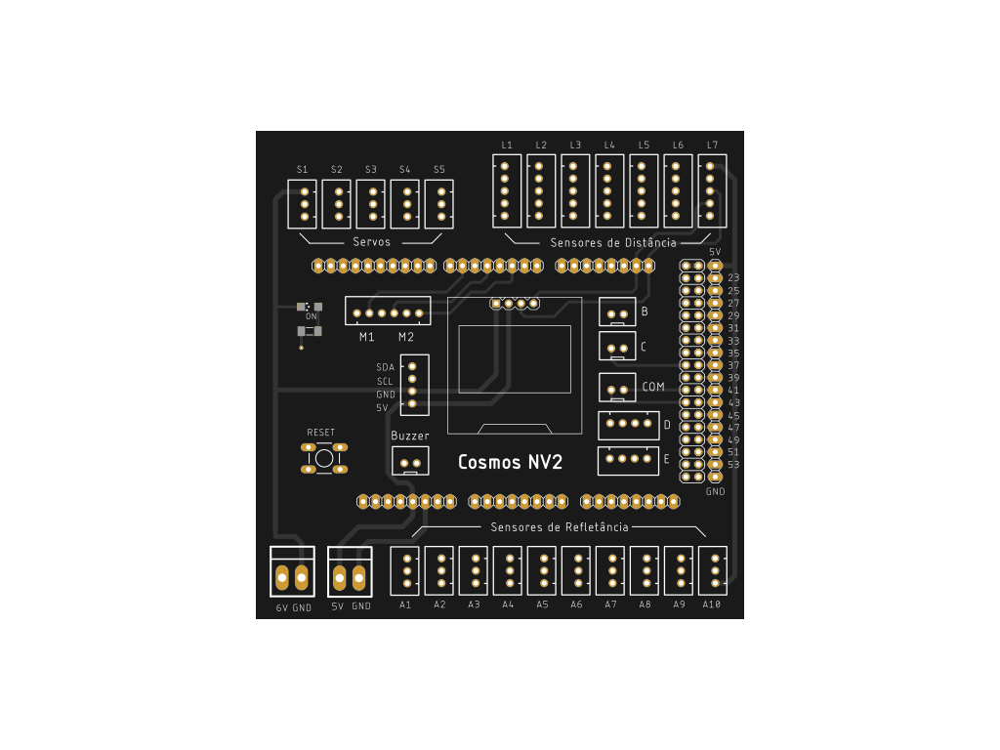

Cosmos NV2 Library
==================
_Biblioteca desenvolvida para o controle da Cosmos NV2 Shield_

## Sobre a plataforma: ##
Sabemos como montar um robô para a OBR é um pouco mais desafiador para as equipes que utilizam Arduino do que para as que utilizam Lego.
Pensando nisso, nós do Laboratório de Automação e Robótica do IFRN Campus Ceará-Mirim (LAR) decidimos criar uma plataforma que facilitasse tanto a parte elétrica como também a programação dos nossos robôs. Construímos então a Cosmos NV2, uma plataforma formada por uma shield, onde os módulos do Arduino são conectados a ele; e uma biblioteca que gerencia o controle desses módulos. Sinta-se a vontade para usar nossa plataforma ou tê-la como inspiração para criar a sua própia.

## Dependências ##  

Esta biblioteca depende das seguintes bibliotecas:
- Adafruit GFX
- Adafruit SSD1306
- Adafruit VL53L0X
- Servo